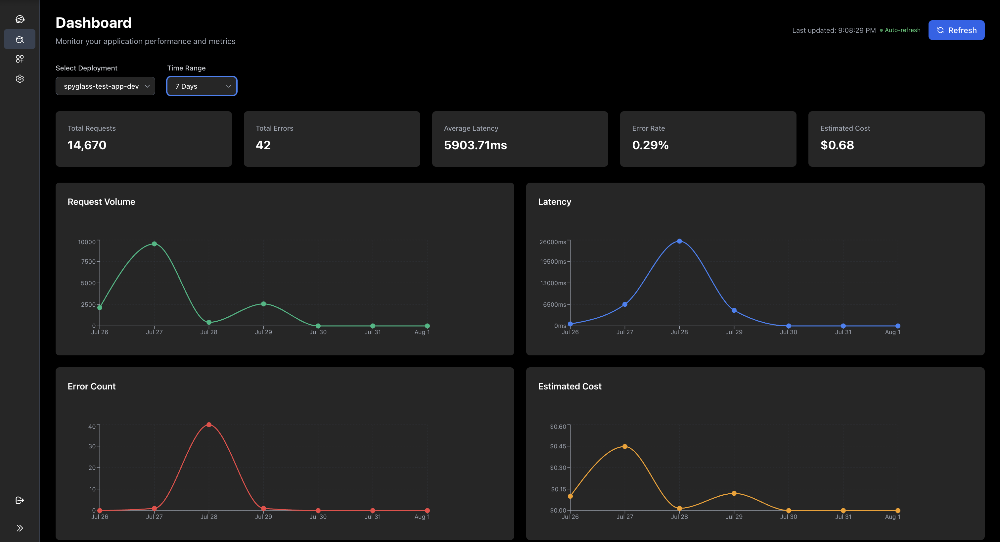
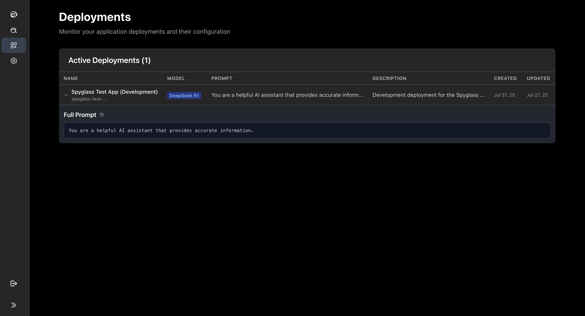

We built AI for your AI. Understand how your AI systems are performing in production and fix problems before they impact your users.

Works with OpenTelemetry and supports first-class instrumentation for OpenAI, LangChain, LlamaIndex, and more AI frameworks.

## Features

### ⚡ Lightning Fast
Real-time metrics and traces across all your production systems

### 🧠 AI For Your AI
Talk to our AI Agent to understand your application's performance and health quickly

### 👀 Know What's In Production
Integrate with GitHub to track your models and prompts in production

## How It Works

Get started with Spyglass AI in three simple steps:

### 1. Instrument Your App
Add the Spyglass SDK to your Python application to start tracking AI model calls automatically.



### 2. Add Model Config  
Create a model.yaml file to parameterize your AI model deployments and track them over time.



### 3. Add A GitHub Action
Set up automated deployment tracking with GitHub Actions to correlate model changes with performance.

### 🤖 AI Agent Integration
Chat with our AI agent to understand your application's behavior, debug issues, and get insights about your system's performance. Ask questions like 'Why did my costs spike yesterday?' or 'Which model is performing best this week?'


## Prerequisites

- Python 3.8+
- OpenAI API key
- Spyglass API key (get one from [spyglass-ai.com](https://spyglass-ai.com))

## Installation

Install the Spyglass SDK:

```bash
pip install spyglass-ai
```

## Basic Setup

1. **Set your API keys**:

```bash
export SPYGLASS_API_KEY="your-spyglass-api-key"
export OPENAI_API_KEY="your-openai-api-key"
export SPYGLASS_DEPLOYMENT_ID="my-app"
```

2. **Wrap your OpenAI client**:

```python
import openai
from spyglass_ai import spyglass_openai

# Wrap your OpenAI client with Spyglass
client = spyglass_openai(openai.OpenAI())
```

3. **Add tracing to your functions**:

```python
from spyglass_ai import spyglass_trace

@spyglass_trace()
def analyze_text(text):
    response = client.chat.completions.create(
        model="gpt-4",
        messages=[
            {"role": "system", "content": "You are a helpful assistant."},
            {"role": "user", "content": f"Analyze this text: {text}"}
        ]
    )
    return response.choices[0].message.content

# Use your traced function
result = analyze_text("Hello, world!")
```

## What Gets Traced

Spyglass automatically captures:

- **API Calls**: All OpenAI API requests and responses
- **Token Usage**: Input and output token counts
- **Response Times**: Latency for each API call
- **Errors**: Failed requests and error details
- **Function Calls**: Custom functions with the `@spyglass_trace()` decorator

## View Your Data

- Navigate to the **Dashboards** tab
- See your API calls in real-time

## Ready to Get Started?

Join teams already using Spyglass AI to monitor their production AI systems.

### 🚀 Quick Setup
Get up and running in under 5 minutes with our simple SDK integration

### 💰 Cost Optimization  
Identify and reduce unnecessary AI spending with detailed cost analytics

### 🔧 Debug Faster
Quickly identify and resolve issues with comprehensive tracing and monitoring

---

## Need Help?

- **Example Project**: Check out our [complete example](https://github.com/Spyglass-AI/spyglass-repos/tree/main/example-project)
- **Support**: Contact us at [team@spyglass-ai.com](mailto:team@spyglass-ai.com) 